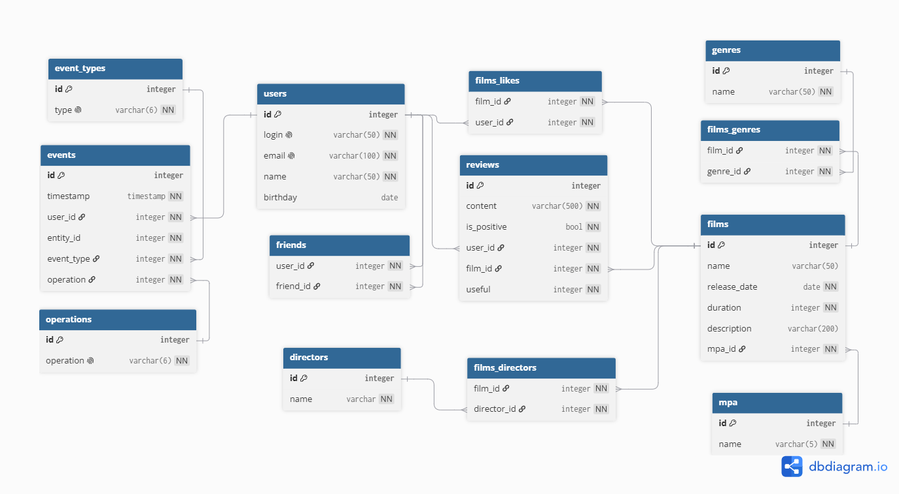

# java-filmorate


## EN
### Description
Filmorate provides access to a collection of films to browse, like, and connect over.
Filmorate API supports viewing, creating and updating users and films. Users can also browse available genres and ratings (MPA).
In addition, the API provides a way to like a movie - or remove the like, to leave a review, as well as add or remove a friend.
The event feed provides a way for users to stay up-to-date with the most recent events. 

### Schema Description
Filmorate databases stores data in the following tables:
* "films" - storing information about films.
* "mpa" - storing the MPA ratings. Supports a one-to-many relationship with "films". The data from this table is available as read-only.
* "genres" - storing the available genres. The data from this table is available as read-only.
* "films_genres" - provides the one-to-many relationship between "films" and "genres".
* "users" - storing information about users.
* "friends" - storing information about existing friendships between users. Has a one-to-many relationship with "users".
* "films_likes" - storing information about likes. Has a one-to-many relationship with "films" and "users".
* "directors" - storing information about directors.
* "films_directors" - storing information about directors in relation to the films they have directed. "One-to-many" relationship with "films" and "directors".
* "reviews" - storing information about the reviews.
* "events" - storing information about events/user activity.
* "operations" - storing operation types of various events (ADD, UPDATE, REMOVE).
* "event_types" - storing supported event types (LIKE, REVIEW, FRIEND).

### API Endpoints
Supported endpoints for films include:
* GET /films - to view the entire collection of films.
* GET /films/popular - to view the most popular films. The endpoint supports pagination using query parameter [count={}].
* GET /films/{id} - to view a specific film.
* POST /films - to publish information about a film. Returns the film object on success.
* PUT /films - to update information about a film. Requires a valid film id to be provided in the request body.
* PUT /films/{film_id}/likes/{user_id} - to add a like to film [film_id] by user [user_id].
* DELETE /films/{film_id}/likes/{user_id} - to remove a like from film [film_id] by user [user_id].

In addition to films, the following endpoints allow accessing the list of genres and MPA ratings used in Filmorate's collection of films:
* GET /genres and GET /genres/{id} - to view all genres and a specific genre respectively. Returns genre id and name.
* GET /mpa and GET /mpa/{id} - to view all MPA ratings and a specific MPA rating respectively. Returns rating id and name.

Supported endpoints for users include:
* GET /users - to view the list of registered users.
* GET /users/{id} - to view the profile of a specific user.
* GET /users/{id}/friends - to view the list of user's friends. Returns a list of id's.
* GET /users/{user_1_id}/friends/common/{user_2_id} - to view which friends user_1 and user_2 share in common.
* POST /users - to register a user within the system. Requires the new user to have unique login and email. Login is used as a username by default, unless the username is provided as [name] in the request body.
* PUT /users - to update user information. Requires a valid user id to be provided in the request body.
* PUT /users/{user_1_id}/friends/{user_2_id} - to add user_2 to the list of user_1's friends. Note: user_2 will have to accept the request for user_1 to be displayed in their friends list.
* DELETE /users/{user_1_id}/friends/{user_2_id} - to remove user_2 from user_1's list of friends.

### SQL Query Samples
To view a collection of data from a table such as "users", "genres" or "mpa", a simple query may be used:
```
SELECT * 
FROM genres;
```

To access information about a film, specifically, a more complex query must be used:
```
SELECT f.id AS id,
       f.name AS name,
       f.release_date AS release_date,
       f.description AS description,
       f.duration AS duration,
       f.mpa_id AS mpa_id,
       m.name AS mpa_name,
       g.id AS genre_id,
       g.name AS genre_name
FROM films AS f
LEFT JOIN mpa AS m ON m.id = f.mpa_id
LEFT JOIN films_genres AS fg ON fg.film_id = f.id
LEFT JOIN genres AS g ON g.id = fg.genre_id
WHERE f.id = ?;
```

Pagination when browsing the most popular movies is achieved using the following query:
```
SELECT f.id AS id,
       f.name AS name,
       f.release_date AS release_date,
       f.description AS description,
       f.duration AS duration,
       f.mpa_id AS mpa_id,
       m.name AS mpa_name,
       g.id AS genre_id,
       g.name AS genre_name
FROM (SELECT films.id AS id,
             COUNT(fl.user_id) AS likes
      FROM films
      LEFT JOIN films_likes AS fl ON fl.film_id = films.id
      GROUP BY films.id
      ORDER BY likes DESC, films.id
      LIMIT 10) popular
LEFT JOIN films AS f ON f.id = popular.id
LEFT JOIN films_genres AS fg ON fg.film_id = f.id
LEFT JOIN genres AS g ON g.id = fg.genre_id
LEFT JOIN mpa AS m ON m.id = f.mpa_id
ORDER BY popular.likes DESC, f.id;
```

Sample query for creating a new user:
```
INSERT INTO users (login, email, name, birthday)
VALUES (?, ?, ?, ?); 
```

Updating user information is done using a query similar to the following one:
```
UPDATE users
SET login = ?,
    email = ?,
    name = ?,
    birthday = ?
WHERE id = ?;
```

Creating and updating "films" uses similar queries, followed by a second query to modify the "films_genres" table:
```
INSERT INTO films_genres (film_id, genre_id)
VALUES (?, ?);
```

Note that when updating film's genres, all previous genres must be removed from "films_genres" before inserting the new ones:
```
DELETE FROM films_genres
WHERE film_id = ?;
```

Accessing the list of a user's friends can be achieved in the following manner:
```
SELECT friend_id
FROM friends
WHERE user_id = ?;
```

---

## RU

### Описание
Filmorate предоставляет доступ к коллекции фильмов. У пользователей есть возможность просмотра информации о них, оценки (лайков) и создания дружбы.
API Filmorate поддерживает просмотр, создание и обновление пользователей и фильмов. Пользователи также могут просматривать доступные жанры и рейтинги (MPA).
Кроме того, API позволяет поставить фильму лайк или убрать его, оставить отзыв на фильм, а также добавлять или удалять пользователей из списка друзей.
Лента событий позволит пользователям оставаться в курсе последних событий на платформе. 

### Описание схемы
Данные представлены в следующих таблицах:
* "films" – хранение информации о фильмах.
* "mpa" – хранение рейтингов MPA. Поддерживает связь «один ко многим» с таблицей "films". Данные таблицы доступны только для чтения.
* "genres" – хранение представленных жанров. Данные таблицы доступны только для чтения.
* "films_genres" – реализует связь «один ко многим» между таблицами "films" и "genres".
* "users" – хранение информации о пользователях.
* "friends" – хранение информации о дружбе между пользователями. Связана отношением «один ко многим» с таблицей "users".
* "films_likes" – хранение лайков. Имеет связь «один ко многим» с таблицами "films" и "users".
*  "directors" - хранение информации о режиссерах.
* "films_directors" - хранение информации о работах режиссеров. Связана отношением "один ко многим" с таблицами "films", "directors".
* "reviews" - хранение информации об отзывах.
* "events" - хранение информации о событиях.
* "operations" - хранение информации о поддерживаемых операциях (ADD, UPDATE, REMOVE).
* "event_types" - хранение информации о поддерживаемых типах событий (LIKE, REVIEW, FRIEND).

### API Endpoints (конечные точки)
Поддерживаемые конечные точки для фильмов:
* GET /films – просмотр всей коллекции фильмов.
* GET /films/popular – просмотр самых популярных фильмов. Поддерживается параметр запроса [count={}] для ограничения числа фильмов.
* GET /films/{id} – просмотр конкретного фильма.
* POST /films – публикация информации о фильме. В случае успеха возвращает объект фильма.
* PUT /films – обновление информации о фильме. Требует указания идентификатора фильма в теле запроса.
* PUT /films/{film_id}/likes/{user_id} – поставить лайк фильму [film_id] от пользователя [user_id].
* DELETE /films/{film_id}/likes/{user_id} – удалить лайк фильма [film_id] от пользователя [user_id].

Следующие эндпоинты позволяют работать со списком жанров и рейтингов MPA, используемых в коллекции фильмов Filmorate:
* GET /genres и GET /genres/{id} – просмотр всех жанров и конкретного жанра соответственно. Возвращает идентификатор и название жанра.
* GET /mpa и GET /mpa/{id} – просмотр всех рейтингов MPA и конкретного рейтинга соответственно. Возвращает идентификатор и название рейтинга.

Поддерживаемые конечные точки для пользователей:
* GET /users – просмотр списка зарегистрированных пользователей.
* GET /users/{id} – просмотр профиля конкретного пользователя.
* GET /users/{id}/friends – просмотр списка друзей пользователя. Возвращает список идентификаторов.
* GET /users/{user_1_id}/friends/common/{user_2_id} – просмотр общих друзей пользователей user_1 и user_2.
* POST /users – регистрация пользователя в системе. Логин и email должны быть уникальными. В качестве имени пользователя по умолчанию используется логин, если в теле запроса не указано поле [name].
* PUT /users – обновление информации о пользователе. Требует указания идентификатора пользователя в теле запроса.
* PUT /users/{user_1_id}/friends/{user_2_id} – добавить user_2 в список друзей пользователя user_1. Примечание: user_2 должен принять запрос, чтобы user_1 отображался в его списке друзей.
* DELETE /users/{user_1_id}/friends/{user_2_id} – удалить user_2 из списка друзей пользователя user_1.

### Примеры SQL-запросов
Для получения набора данных из таблиц «users», «genres» или «mpa» можно использовать простой запрос:
```
SELECT * 
FROM genres;
```

Получение информации о фильме подразмуевает более сложный запрос:
```
SELECT f.id AS id,
       f.name AS name,
       f.release_date AS release_date,
       f.description AS description,
       f.duration AS duration,
       f.mpa_id AS mpa_id,
       m.name AS mpa_name,
       g.id AS genre_id,
       g.name AS genre_name
FROM films AS f
LEFT JOIN mpa AS m ON m.id = f.mpa_id
LEFT JOIN films_genres AS fg ON fg.film_id = f.id
LEFT JOIN genres AS g ON g.id = fg.genre_id
WHERE f.id = ?;
```

При помощи следующего запроса можно посмотреть топ самых популярных фильмов:
```
SELECT f.id AS id,
       f.name AS name,
       f.release_date AS release_date,
       f.description AS description,
       f.duration AS duration,
       f.mpa_id AS mpa_id,
       m.name AS mpa_name,
       g.id AS genre_id,
       g.name AS genre_name
FROM (SELECT films.id AS id,
             COUNT(fl.user_id) AS likes
      FROM films
      LEFT JOIN films_likes AS fl ON fl.film_id = films.id
      GROUP BY films.id
      ORDER BY likes DESC, films.id
      LIMIT 10) popular
LEFT JOIN films AS f ON f.id = popular.id
LEFT JOIN films_genres AS fg ON fg.film_id = f.id
LEFT JOIN genres AS g ON g.id = fg.genre_id
LEFT JOIN mpa AS m ON m.id = f.mpa_id
ORDER BY popular.likes DESC, f.id;
```

Создание пользвателя:
```
INSERT INTO users (login, email, name, birthday)
VALUES (?, ?, ?, ?); 
```

Обновление данных о пользователе:
```
UPDATE users
SET login = ?,
    email = ?,
    name = ?,
    birthday = ?
WHERE id = ?;
```

Создание и обновление данных о фильме производится аналогично подобным запросам при работе с пользователями, но требует дополнительного запроса к таблице "films_genres":
```
INSERT INTO films_genres (film_id, genre_id)
VALUES (?, ?);
```

При этом при обновлении данных о фильме перед внесением обновленных жанров требуется удалить записи о предыдущих жанрах:
```
DELETE FROM films_genres
WHERE film_id = ?;
```

Список друзей пользвателя может быть получен следующим путем:
```
SELECT friend_id
FROM friends
WHERE user_id = ?;
```
